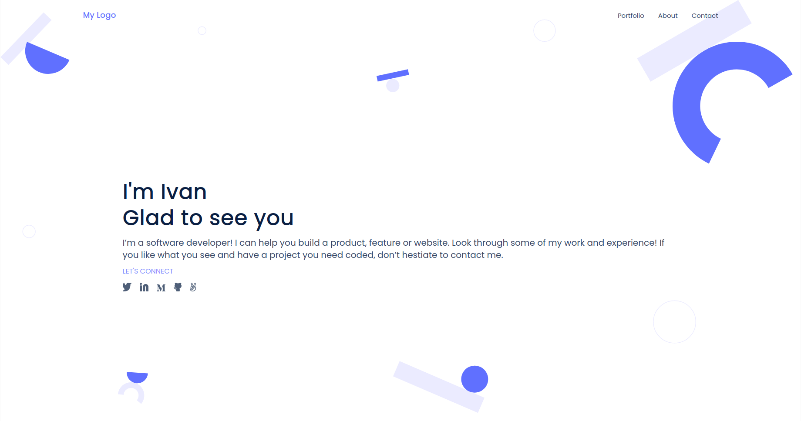
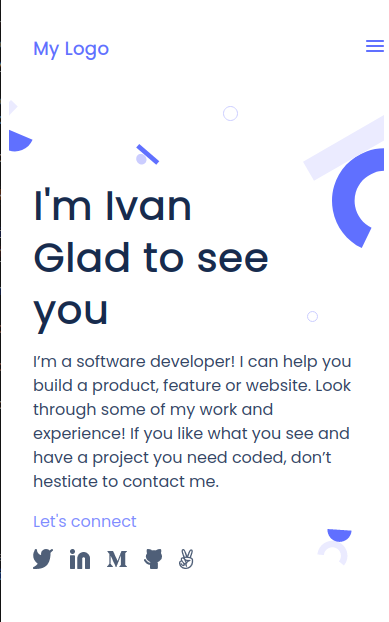

# My Portfolio

> This is our first digital portfolio as software developers in Microverse.

Take a look at how it is going! https://ikuartz.github.io/Portfolio-queries/

Our objective is to create a website as similar as possible with this design
in Figma: https://www.figma.com/file/l7SqJ3ZfkAKih9sFxvWSR4/Microverse-Student-Project-1?node-id=34%3A848 .

I chose template 1 to mimic.

Below are some screenshots of the deployed website as it was on 17/01/22

## Project Timeline

07/01/22 - Implemented works and about sections.

12/01/22 - Now working on fully adaptable portfolio for mobile and desktop.

17/01/22 - Mobile and desktop versions working with react css, deployed with github pages.

## Built With

- HTML
- CSS
- GIT
- GitHub
- Love

## Authors

👤 **Ivan Silva**

- GitHub: [@iKuartz](https://github.com/iKuartz/)
- Twitter: [@iKuartz01](https://twitter.com/iKuartz01)
- LinkedIn: [Ivan Silva](https://www.linkedin.com/in/ivan-silva-a47058b3/)

## 🤝 Contributing

My code partners at Microverse, patiently teaching me plenty.
Ntare Guy, Mengstu Fentaw and Fernando Salas, thank you!

## Show your support

Give a ⭐️ if you like this project!
And feel free to leave suggestions for improvements!
Thank you!
